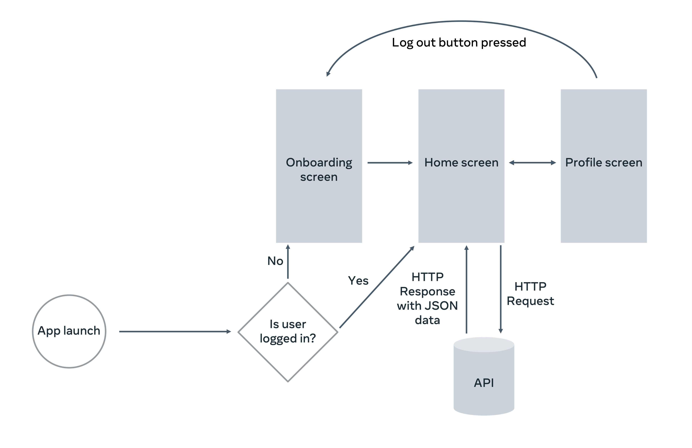

  

<h1 align="center">little-lemon-react-native-app</h>

  
  

# Little Lemon Mobile App

This project marked the conclusion of Meta's React Native Developer Specialization Course, representing the pinnacle of the React Native Developer Development Track.

## Overview

This project aims to create a mobile app for Little Lemon, where users can view menu items, their descriptions, and images before placing an order. The app will fetch data from a network to ensure that users always see the most current information.

## Key Functionalities

- **Display Menu Items**: Users can view a boldly written name, a high-quality image, and a short description of each menu item.
- **Fetch and Store Data**: Data (including images) will be fetched asynchronously from the network to provide a seamless user experience.
- **Establish Food Ordering Flow**: Once menu items are displayed, users will be able to proceed with the food ordering flow.

## Steps to Implement

1. **Fetching Data**: Learn how to fetch menu item data and images asynchronously from the network.
2. **Storing Data**: Implement storage mechanisms to store fetched data locally for offline access.
3. **Rendering Data**: Render fetched menu items and images in the app interface.
4. **Establishing Food Ordering Flow**: Utilize a flow chart provided to establish the food ordering flow, identifying and breaking down important steps.
5. **Filtering Data**: Learn how to filter data to give users the ability to customize how information is displayed.

